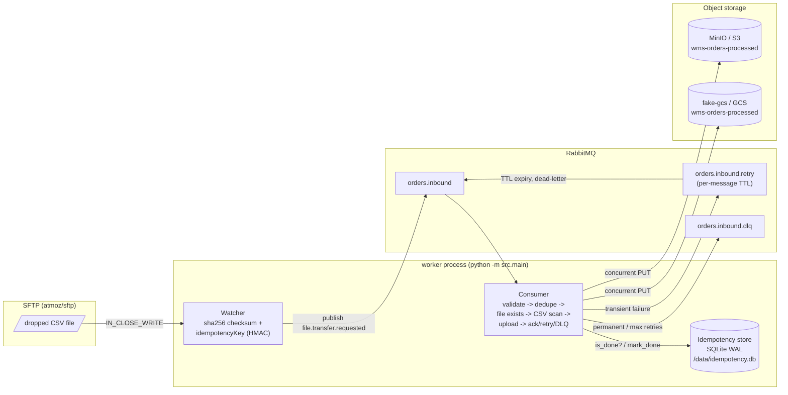
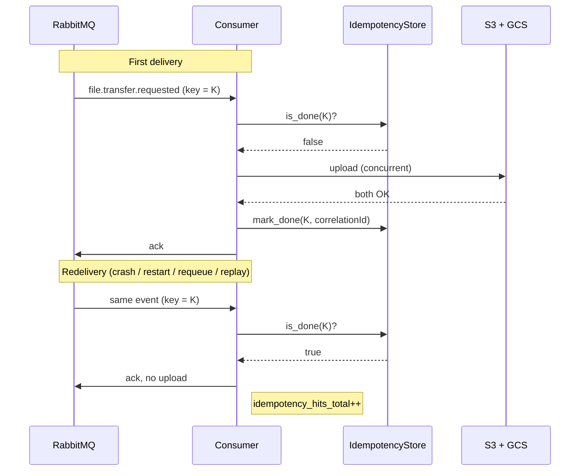

# Exercise 2
## Event-Driven Cross-Cloud Transfer Worker

**Exercise 2: SFTP → RabbitMQ (retry/DLQ) → dual-cloud upload (S3 + GCS), with idempotency built in end-to-end**

- A file lands on SFTP → a watcher publishes one small event → a consumer copies the
  file to AWS S3 (MinIO locally) and GCP GCS (fake-gcs locally), concurrently
- Every layer between "file lands" and "file is in both buckets" is **at-least-once**
  (broker redeliveries, retries, worker restarts) — **idempotency is what makes that safe**
- Runs fully locally: `make up && make smoke`, no real cloud accounts needed

---

## Architecture at a glance



- Watcher and consumer are two threads of one process (`worker/src/main.py`), each
  owning its own RabbitMQ connection
- `orders.inbound.retry` + dead-letter-exchange gives delayed redelivery without the
  (non-stock) delayed-message plugin
- The idempotency store sits next to the consumer — checked **before** any work,
  written **after** all work succeeds

---

## Happy-path walkthrough

1. `ORD-...csv` lands on SFTP → watcher sees `IN_CLOSE_WRITE`
2. Watcher computes `sha256(file)`, derives `idempotencyKey`, publishes
   `file.transfer.requested` to `orders.inbound`
3. Consumer: schema valid, supported version → continue
4. Consumer: **`is_done(idempotencyKey)` → false** (first time seeing this file)
5. Source file present, CSV security scan passes (size / encoding / formula-injection)
6. Concurrent upload to MinIO (S3) and fake-gcs (GCS)
7. Both succeed → **`mark_done(idempotencyKey, correlationId)`**, then ack
8. `events_consumed_total{result="success"}` increments

---

## Idempotency — the guarantee

Everything upstream of "mark done" is **at-least-once**, by design:

- RabbitMQ redelivers unacked messages (consumer crash, requeue, worker restart)
- The retry path republishes the *same* event with `retry.attempt` incremented
- An operator can manually replay a message out of the DLQ

So the consumer's core invariant is:

> Processing the same `file.transfer.requested` event **N times** must leave the system
> in the **same end state** as processing it **once** — no duplicate uploads, no
> duplicate downstream side effects, no file silently skipped.

Everything below is in service of that one sentence.

---

## The idempotency key

```python
idempotencyKey = "sha256:" + HMAC_SHA256(
    key = CORRELATION_SECRET,
    msg = f"{source_path}|{size_bytes}|{checksum_sha256}",
).hexdigest()
```

`src/utils.py:compute_idempotency_key` — computed **once**, by the watcher, at publish time.

- **Deterministic** — same path + size + content -> same key, every time
- **Stable across redeliveries** — `eventId` is fresh on every republish;
  `idempotencyKey` never changes for the same file
- **HMAC, not a bare hash** — the key can't be precomputed or forged without
  `CORRELATION_SECRET`, so a crafted/duplicated event can't be used to trick the
  consumer into silently skipping a real file
- Carried unchanged through `retry.attempt` 1, 2, 3, ... — the dedupe check applies
  identically on every attempt

---

## Idempotency in the consumer state machine



Ordering is the whole trick:

1. **Dedupe check runs first** (right after schema validation) — a duplicate skips file
   I/O, the CSV security scan, *and* both uploads
2. **`mark_done` runs only after every destination reports success** — a partial
   failure leaves the key unset, so a retry/redelivery correctly redoes the work
3. The SQLite store (`/data/idempotency.db`, WAL mode) lives on the `worker-data`
   volume — it survives `docker compose restart worker`

---

## Three layers of idempotency

| Layer | Mechanism | Protects against |
|---|---|---|
| **Event-level dedupe** | `idempotencyKey` + SQLite `processed_events` table | Redoing a *fully completed* file on redelivery/restart — saves cost and avoids re-triggering downstream systems |
| **Upload-level overwrite** | S3 `PutObject` / GCS upload to a deterministic key `orders/<filename>` | A retried or crash-interrupted upload re-running is a no-op overwrite, never a duplicate object |
| **Downstream overwrite** (ADR 0002, illustrative `infra/terraform/`) | Lambda / Cloud Function key writes on `order_id` + `sku` into DynamoDB / Firestore | A re-fired `ObjectCreated` / Eventarc notification overwrites the same row/document instead of duplicating it |

Layer 1 is the fast path (skip the work entirely). Layers 2 and 3 are the safety net
for everything that happens *before* layer 1 can kick in.

---

## Idempotency under failure — scenarios

| Scenario | What happens | Why it's safe |
|---|---|---|
| Consumer crashes mid-upload (S3 done, GCS not) | Message stays unacked → RabbitMQ redelivers | `mark_done` never ran → `is_done=false` → both uploads retried; S3 overwrite (layer 2) makes the repeat PUT harmless |
| Worker restart (`docker compose restart worker`) | SQLite persists on `worker-data` volume | A redelivered message for an already-completed file hits `is_done=true` → ack, no re-upload, `idempotency_hits_total++` |
| Retry-queue redelivery (TTL expiry) | Same event body, `retry.attempt + 1`, same `idempotencyKey` | Dedupe check still applies; success marks the key done exactly once |
| Manual DLQ replay (runbook) | Operator republishes a DLQ message | If it had partially succeeded, overwrite-safety (layer 2) avoids duplicates; otherwise it's processed normally |
| Two different files, identical bytes | Same `checksumSha256`, different `source_path` | `source_path` is part of the key — distinct files are never conflated |

---

## Supporting safeguards (defense in depth)

- **Retry + backoff**: a transient upload failure republishes to `orders.inbound.retry`
  with a per-message TTL (`RETRY_BACKOFF_BASE` to the power of `attempt`, in seconds),
  dead-lettered back to `orders.inbound` on expiry. After `RETRY_MAX_ATTEMPTS` → DLQ.
- **DLQ, never silently dropped**: `invalid_payload`, `unsupported_schema_version`,
  `source_file_missing`, `csv_security_check_failed`, `max_retries_exceeded` — every
  terminal failure carries `x-dlq-reason` / `retry.lastError` for replay.
- **Basic CSV security scan** (`src/csv_security.py`, runs *after* the dedupe check,
  *before* upload):
  - file-size limit (`MAX_CSV_FILE_SIZE_BYTES`)
  - binary / non-UTF-8 content rejected
  - **formula / CSV-injection (CWE-1236)** — cells starting with `=`, `+`, `-`, `@`,
    tab, or CR are flagged
  - because dedupe runs first, a redelivered duplicate of an already-rejected file is
    never re-read or re-scanned

---

## Observability — proving idempotency works

```sh
curl -s localhost:8080/metrics | grep -E \
  'idempotency_hits_total|events_consumed_total|csv_security_rejections_total'
```

- `idempotency_hits_total` — count of redeliveries skipped as duplicates
- `events_consumed_total{result="duplicate"}` — same signal, per-result breakdown
- **Restart demo** (`docs/runbook.md`): `make drop-file` → `make restart-worker` →
  redeliver/replay the same event → logs show `"duplicate event, skipping"`, no new
  uploads, store untouched
- Inspect the store directly — `processed_events(idempotency_key, correlation_id,
  processed_at)` via the stdlib `sqlite3` module (kept out of the runtime image)

---

## Close — what to say

1. **The pipeline**: SFTP → watcher → RabbitMQ (main / retry / DLQ) → consumer →
   S3 + GCS concurrently, with a stdlib `/health` `/ready` `/metrics` server.
2. **Idempotency isn't one mechanism** — it's an HMAC-derived key (so correctness
   can't be gamed without the secret), a dedupe store that's checked first and
   written last, plus overwrite-safe uploads and overwrite-safe downstream writes.
3. **At-least-once delivery, exactly-once *effect*** — that's the actual guarantee,
   and it's achieved by construction (ordering + persistence), not by careful
   sequencing that's easy to get wrong under crashes.
4. **Scales down to one box, scales up cleanly** — SQLite today; swap for
   Redis/Postgres behind the same `is_done` / `mark_done` interface for multiple
   worker replicas.

> More detail: [`docs/architecture.md`](docs/architecture.md) (full diagram + design
> rationale), [`docs/event-contract.md`](docs/event-contract.md) (schema, retry/DLQ
> rules), [`ADR.md`](ADR.md) (decisions & trade-offs), [`docs/runbook.md`](docs/runbook.md)
> (operations, including the idempotency-on-restart demo).
