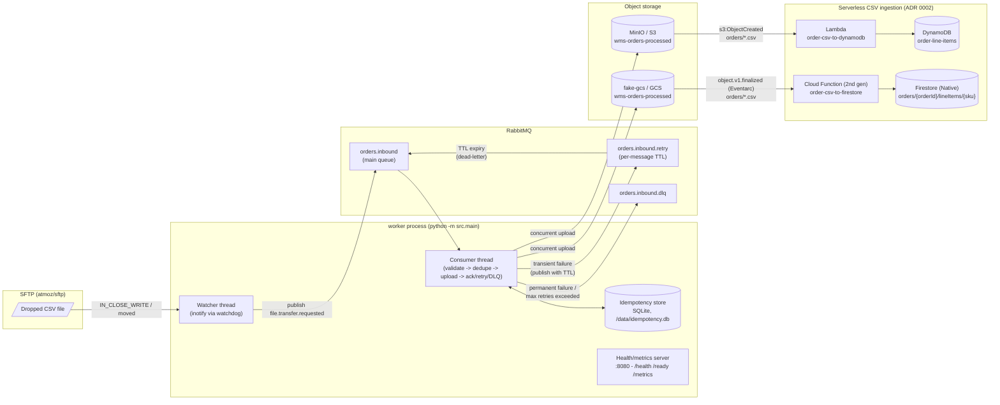

# Architecture

## Pipeline overview

## Components

### Watcher thread (`src/watcher.py`)
Uses [`watchdog`](https://pypi.org/project/watchdog/) (inotify on Linux) to watch
`WATCH_DIR` recursively. `IN_CLOSE_WRITE` (a write completed) and move/rename
events (common for SFTP clients that write to a temp name and rename into
place) both trigger `build_event()`, which:

- computes a SHA-256 checksum and size for the file,
- derives a stable `idempotencyKey` (HMAC-SHA256 over path + size + checksum,
  see `src/utils.py:compute_idempotency_key`),
- builds a `file.transfer.requested` event (`src/schema.py:TransferEvent`)
  with one `destination` per cloud target (`aws-s3`, `gcp-gcs`),
- publishes it to `orders.inbound` via `src/publisher.py:Publisher`.

The watchdog `Observer` runs callbacks on its own thread, but
`pika.BlockingConnection` is not thread-safe. The event handler only pushes
detected paths onto a `queue.Queue`; `run_watcher` (on the watcher thread)
drains that queue and does the actual publish, so all broker I/O for this
connection stays single-threaded.

### RabbitMQ topology (`src/publisher.py:declare_topology`)
Declared idempotently at startup by **both** the watcher and consumer
connections (RabbitMQ no-ops a `queue_declare` with identical arguments), so
it's the single source of truth - there is no separate `definitions.json` to
keep in sync.

| Queue | Purpose |
|---|---|
| `orders.inbound` | Main queue, consumed by `src.consumer`. |
| `orders.inbound.retry` | Holding queue. Messages are published here with a per-message TTL (the `expiration` property); `x-dead-letter-exchange`/`x-dead-letter-routing-key` send them back to `orders.inbound` on expiry - i.e. delayed retry without the delayed-message-exchange plugin. |
| `orders.inbound.dlq` | Terminal failures - inspected/replayed manually (see `docs/runbook.md`). |

### Consumer thread (`src/consumer.py`)
Drives a validate → dedupe → upload → ack/retry/DLQ state machine, one
message at a time (`prefetch_count = UPLOAD_MAX_CONCURRENCY`):

1. **Parse & validate** the event against the schema (`src/schema.py`). An
   invalid payload or unsupported `schemaVersion` major goes straight to the
   DLQ - retrying a malformed message can't fix it.
2. **Idempotency check** (`src/idempotency.py`): if `idempotencyKey` is
   already marked done, ack and skip - this makes redeliveries (broker
   crash, requeue after worker restart) safe.
3. **Upload** the source file to every `destination` concurrently
   (`src/uploader.py:upload_all`).
4. **On full success**: mark the idempotency key done, ack.
5. **On any failure**: if `retry.attempt` would exceed `RETRY_MAX_ATTEMPTS`,
   publish to the DLQ with `retry.lastError` populated; otherwise publish to
   `orders.inbound.retry` with `expiration = RETRY_BACKOFF_BASE ** attempt`
   seconds and ack the original message.

### Uploader (`src/uploader.py`)
Both `boto3` (S3/MinIO) and `google-cloud-storage` (GCS/fake-gcs) are
synchronous, so each destination's upload runs via `asyncio.to_thread`,
bounded by an `asyncio.Semaphore(UPLOAD_MAX_CONCURRENCY)` and a per-destination
`asyncio.wait_for(..., timeout=UPLOAD_TIMEOUT_S)`. Every upload returns an
`UploadResult` (never raises) so the consumer can decide retry vs. DLQ for
each destination independently while still waiting for *all* of them.

### Idempotency store (`src/idempotency.py`)
A small SQLite database (`IDEMPOTENCY_DB_PATH`, default `/data/idempotency.db`,
backed by the `worker-data` volume in `infra/docker-compose.yml`) recording
`idempotency_key -> correlation_id` for fully-processed events. WAL mode lets
the watcher and consumer threads share one connection safely. Surviving
`docker compose restart worker` is the point - see `docs/runbook.md` for the
restart demo.

### Health/metrics server (`src/health.py`)
A dependency-free `ThreadingHTTPServer` on the main thread, serving:

- `/health` - liveness (process is up).
- `/ready` - readiness; 200 only once **both** the watcher and consumer
  threads report a live broker connection (`ReadinessState`).
- `/metrics` - Prometheus text format (`src/metrics.py`):
  `events_published_total`, `events_consumed_total{result}`,
  `upload_duration_seconds{provider}`, `uploads_total{provider,result}`,
  `dlq_messages_total`, `idempotency_hits_total`.

### Serverless CSV ingestion (`infra/terraform/aws_lambda.tf`, `gcp_function.tf`)
Downstream of the worker's uploads, each cloud has one small function that
turns the `orders/*.csv` objects into queryable NoSQL rows - see ADR 0002 for
the full evaluation and trade-offs:

- **AWS**: `aws_s3_bucket_notification` fires `order-csv-to-dynamodb` (Lambda,
  Python 3.12,
  [`functions/aws_order_csv_to_dynamodb/handler.py`](../infra/terraform/functions/aws_order_csv_to_dynamodb/handler.py))
  directly on `s3:ObjectCreated:*` for `orders/*.csv`. It streams the object,
  parses it with `csv.DictReader`, and `batch_writer().put_item()`s one item
  per row into the `order-line-items` DynamoDB table (partition key
  `orderId`, sort key `sku`, `PAY_PER_REQUEST` billing). Failed async
  invocations land in an SQS dead-letter queue.
- **GCP**: `order-csv-to-firestore` (Cloud Functions 2nd gen, Python 3.12,
  [`functions/gcp_order_csv_to_firestore/main.py`](../infra/terraform/functions/gcp_order_csv_to_firestore/main.py))
  has a built-in Eventarc trigger on
  `google.cloud.storage.object.v1.finalized` for the same bucket, filtered
  in-code to `orders/*.csv`. It downloads the object, parses it the same way,
  and `set()`s one document per row at `orders/{orderId}/lineItems/{sku}` in a
  Firestore (Native mode) database.
- **Idempotent by overwrite**: both functions key writes on the CSV's own
  `order_id`/`sku` columns, so a redelivered notification overwrites the same
  item/document rather than duplicating it - no separate dedupe table, the
  same pattern Benthos uses (`collision_mode: overwrite`, `guide/13-benthos.md`).

## Data-flow walkthroughs

**Happy path**: file lands → watcher detects `IN_CLOSE_WRITE` → publishes to
`orders.inbound` → consumer validates, dedupe-checks (miss), uploads to MinIO
+ fake-gcs concurrently, both succeed → idempotency key marked done → message
acked. `events_consumed_total{result="success"}` increments.

**Retry path**: one or both uploads fail transiently (e.g. timeout) →
consumer computes `attempt = previous_attempt + 1`, publishes the event to
`orders.inbound.retry` with `expiration = (RETRY_BACKOFF_BASE ** attempt) * 1000`
ms, acks the original message → after the TTL expires, RabbitMQ dead-letters
the message back onto `orders.inbound` → consumer processes it again with
`retry.attempt` incremented. `events_consumed_total{result="retry"}`
increments each time.

**DLQ path**: either (a) the event fails schema validation/version check, (b)
the source file is missing on disk, or (c) `attempt > RETRY_MAX_ATTEMPTS` -
in all cases the consumer publishes to `orders.inbound.dlq` (with
`x-dlq-reason` / `retry.lastError` context) and acks the original message, so
it's never silently dropped or stuck retrying forever.
`dlq_messages_total` increments.

**Serverless ingestion path**: once the worker's S3 upload completes, the
bucket notification invokes `order-csv-to-dynamodb`, which writes one
DynamoDB item per CSV row; in parallel, once the GCS upload completes,
Eventarc invokes `order-csv-to-firestore`, which writes one Firestore document
per row. Both run independently of the RabbitMQ pipeline and of each other -
a failure in one cloud's function doesn't block the other's, and a
redelivered trigger just overwrites the same rows/documents.

## Design rationale

- **Broker-first.** The watcher only has to durably publish one small JSON
  event; everything slow/fallible (uploads to two clouds) happens on the
  consumer side, decoupled by RabbitMQ. A worker crash mid-upload just means
  the message is redelivered - no bespoke crash-recovery logic needed.
- **TTL + dead-letter-exchange retry instead of the delayed-message plugin.**
  `rabbitmq:3.13-management` doesn't ship the
  `rabbitmq_delayed_message_exchange` community plugin. A holding queue with
  per-message `expiration` and `x-dead-letter-*` arguments gives the same
  delayed-retry behaviour using only stock RabbitMQ features.
- **HMAC-derived idempotency key + SQLite.** Deriving the key from
  `path|size|checksum` under a shared secret makes it stable across
  redeliveries (so dedupe works) while not being guessable/forgeable by
  anything that doesn't hold the secret. SQLite is enough for a
  single-instance worker and needs zero extra infrastructure; a multi-instance
  deployment would swap this for Redis/Postgres (see `ADR.md`).
- **Concurrent dual-cloud upload via asyncio + semaphore + per-destination
  timeout.** Both cloud SDKs are synchronous; `asyncio.to_thread` lets both
  uploads run in parallel without a second process, while the semaphore caps
  concurrent threads and the per-destination timeout stops one slow provider
  from blocking the other's result.
- **Stdlib-only health/metrics server.** No Flask/FastAPI dependency keeps the
  runtime image smaller and reduces the surface `pip-audit`/`bandit` need to
  cover, for three small endpoints.
- **One directly-triggered function per cloud for CSV ingestion, not a shared
  orchestrator.** DynamoDB and Firestore are both fully serverless and
  pay-per-request, and S3/GCS notifications can invoke a function directly -
  so no queue, state machine, or always-on service is needed between "file
  lands" and "rows are queryable". See `ADR.md` (ADR 0002) for the full
  per-service evaluation and the DLQ asymmetry this introduces.
